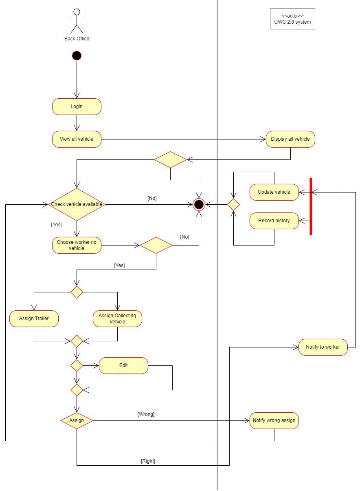
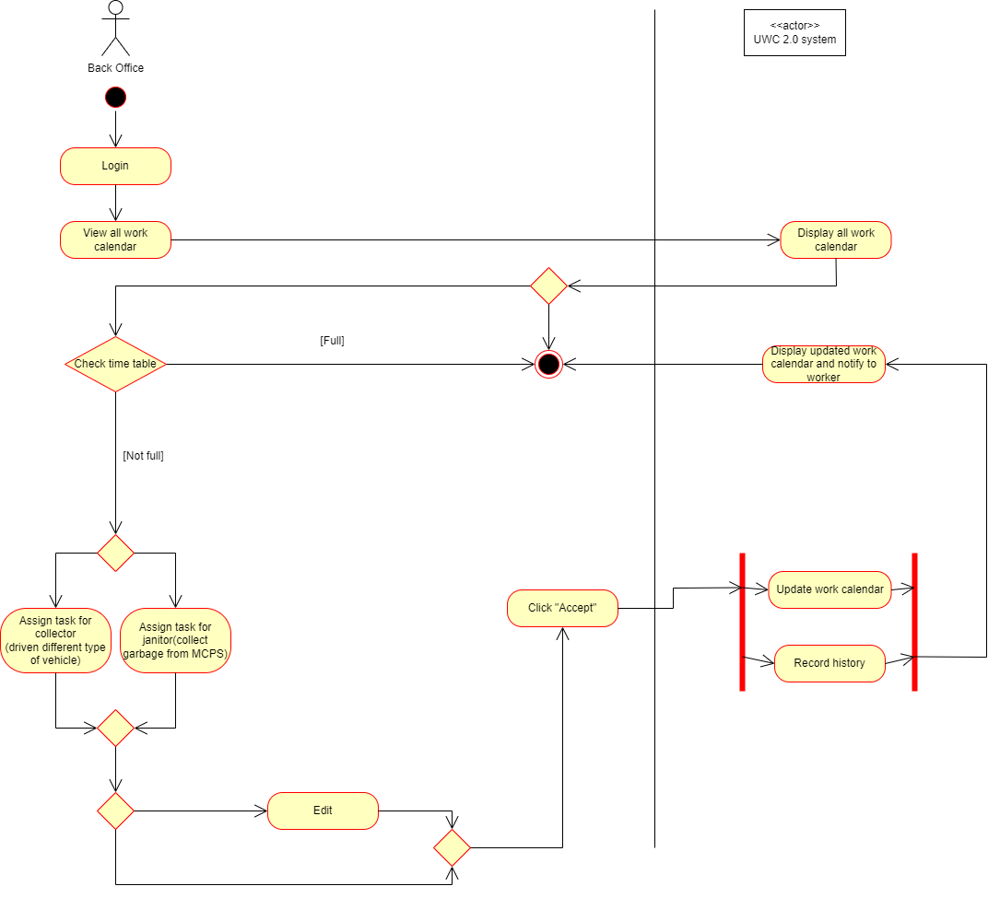
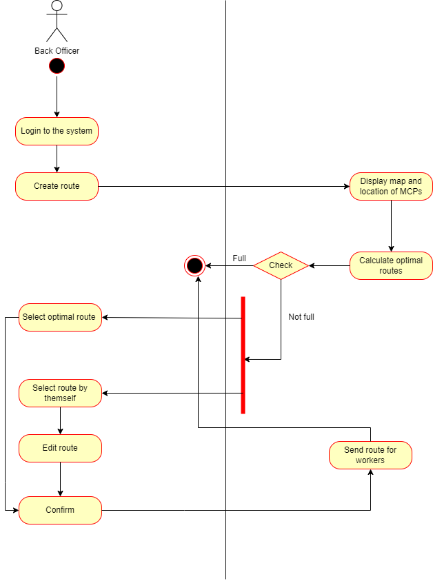
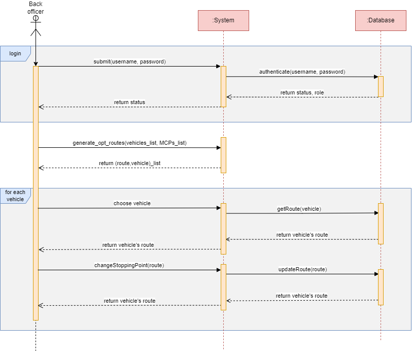
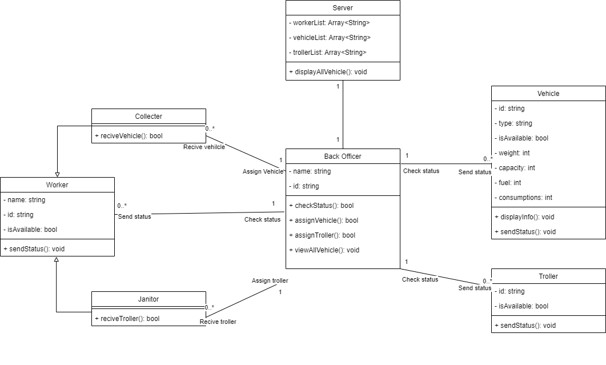
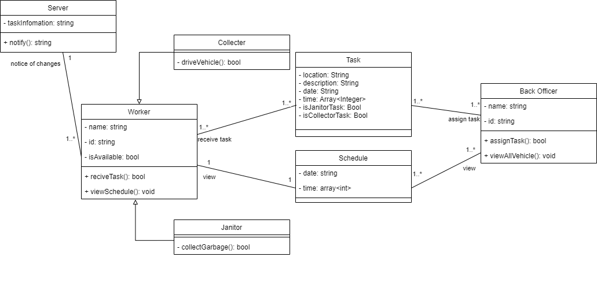
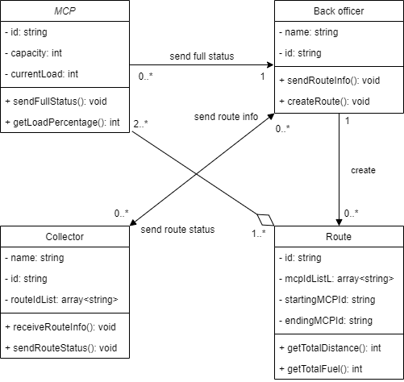

# System Modelling

## 1. Activity diagram

### 1.1 Assign vehicle

	

### 1.2 Assign task

	

### 1.3 Create route

	

## 2. Sequence diagram

	

Giải pháp cho công việc route planning:
1. Xác thực danh tính back officer.
2. Dùng hàm sinh ra các lộ trình tối ưu cho phương tiện.
3. Chọn phương tiện cần chỉnh sửa lộ trình.
4. Điều chỉnh các điểm dừng của phương tiện đó.
5. Quay lại bước 3 nếu còn phương tiện cần sửa lộ trình.

## 3. Class diagram

### 3.1 Assign vehicle

	

**Mô tả:**        
- Mỗi class có lưu thông tin id làm khóa.
- Back officer có thể xem thông tin kỹ thuật của vehicles.
- Back officer có thể kiểm tra trạng thái của cái worker (đã được assign vehicles hay chưa) và trạng thái của các vehicles.
- Back officer sẽ thêm vehicles cho các collector hoặc thêm troller cho các janitor.

### 3.2 Assign task

	

**Mô tả:**
- Trong giao diện dành cho các worker (Collector và Janitor) sẽ hiển thị thời khóa biểu của họ và mỗi worker chỉ có thể xem thời khóa biểu của chính mình.
- Back officer có thể xem thời khóa biểu của tất cả worker.
- Back officer sẽ thêm nhiệm vụ cho các worker, mỗi nhiệm vụ sẽ bao gồm thời gian, địa điểm, mô tả, công việc của Collector hay Janitor. Sau khi back officer xác nhận thay đổi thì Server sẽ gửi thông báo về sự thay đổi lịch làm việc đến worker. 

### 3.3 Create route

	

**Mô tả:**
- Mỗi class có lưu thông tin id làm khóa. Riêng back officer và collector có thêm thuộc tính name lưu tên của nhân viên đó.
- Thông tin MCP có lưu sức chứa tối đa (capacity) và lượng rác đang được chứa (currentLoad). Khi một MCP gần đầy (95\% (getLoadPercentage)), nó sẽ gửi thông báo đến một back officer (sendFullStatus).
- Back officer tiến hành tạo một route (createRoute), bao gồm việc tạo ra nhiều route khác nhau dựa trên vị trí và trạng thái các MCP (được lấy từ database), sau đó chọn ra route tiết kiệm nhiên liệu nhất (getTotalDistance và getTotalFuel). Route được tạo có chứa thông tin về MCP bắt đầu (startingMCPId), MCP kết thúc (endingMCPId) và danh sách các MCP cần đi qua (mcpIdList).  Route này sau đó được gửi (sendRouteInfo) đến một collector nào đó.
- Mỗi collector được lưu thông tin về danh sách các route họ cần phải đi qua (routeIdList). Back officer lựa chọn collector từ danh sách các collector (được lấy từ database) để gửi thông tin route dựa vào số lượng route trong routeIdList: Càng ít việc để làm thì càng được ưu tiên lựa chọn. Collector nhận thông tin route (receiveRouteInfo) và sau khi hoàn thành một route thì họ sẽ gửi thông báo về cho back officer (sendRouteStatus).
