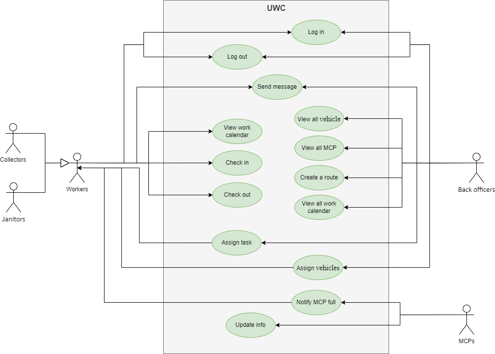
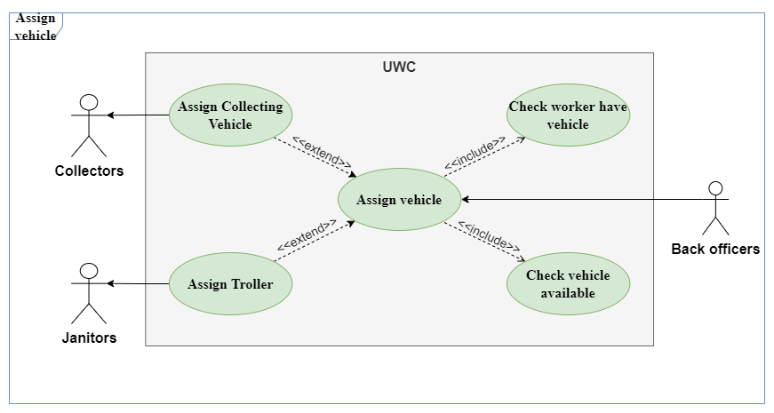
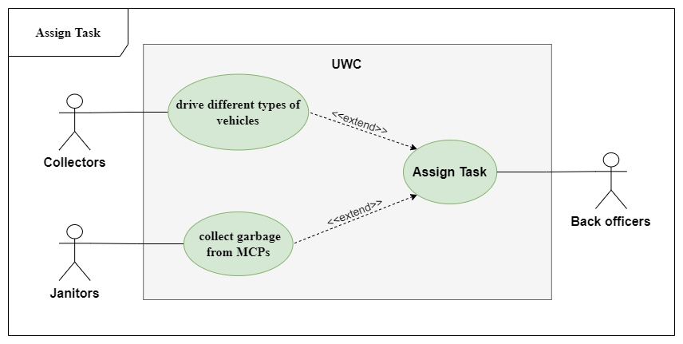
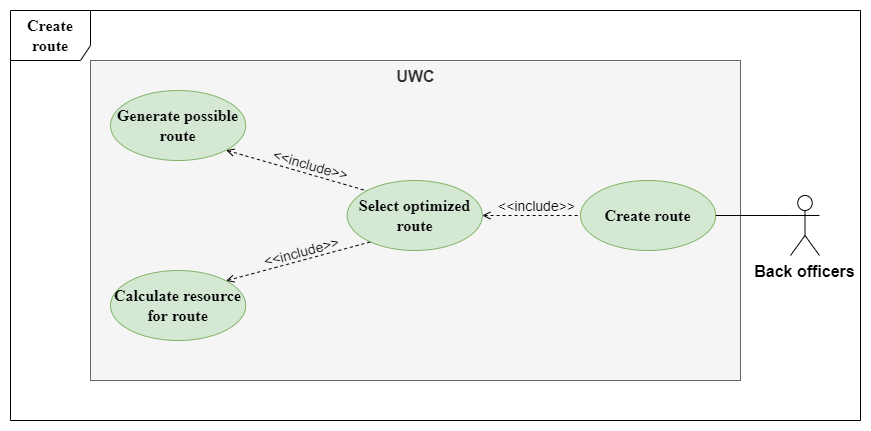

# Requirement Elicitation

## 1. Yêu cầu của hệ thống (requirement)

### 1.1 Yêu cầu chức năng (functional requirement)

#### Nhân viên văn phòng (Back officers):

- Xem được lịch của công nhân vệ sinh (Janitors) và công nhân thu gom (Collectors).
- Xem được các xe gom rác và thông số (tải trọng, sức chứa, mức tiêu thụ nhiên liệu,...).
- Xem được các bãi thu gom rác (MCPS) và thông tin về sức chứa của bãi.
- Chỉ định xe gom rác cho công nhân vệ sinh và công nhân thu gom.
- Chỉ định công nhân vệ sinh và công nhân thu gom đến những bãi thu gom rác.
- Lập tuyến đường cho xe gom rác tối ưu về việc sử dụng nhiên liệu và quãng đường.
- Gửi tin nhắn cho công nhân vệ sinh và công nhân thu gom.

#### Công nhân vệ sinh (Janitors) và công nhân thu gom (Collectors):

- Xem được lịch làm việc của họ.
- Xem chi tiết công việc cần làm theo ngày và theo tuần.
- Giao tiếp với công nhân thu gom, các công nhân vệ sinh khác và nhân viên văn phòng.
- Điểm danh đi làm/rời làm mỗi ngày.
- Được thông báo về các bãi thu gom rác nếu các bãi thu gom rác đã đầy.

### 1.2 Yêu cầu phi chức năng (non-functional requirement)

#### Hiệu năng

- Thông tin cập nhật từ bãi thu gom rác mỗi 15 phút và khả dụng trong 95% thời gian vận hành.
- Hệ thống tin nhắn thời gian thực, với delay ít hơn 1 giây.
- Hệ thống xử lý dữ liệu thời gian thực với ít nhất 1.000 bãi thu gom rác vào thời điểm hiện tại và 10.000 bãi thu gom rác trong 5 năm tới.

#### Tính dễ sử dụng

- Hiển thị chi tiết công việc cần làm theo ngày và theo tuần cho công nhân vệ sinh và công nhân thu gom trên 1 trang.

#### Interoperability

- Nhập dữ liệu từ UWC 1.0.
- Có thể vận hành cùng lúc với UWC 1.0.

#### Đa ngôn ngữ

- Giao diện bằng tiếng việt, với khả năng thêm tiếng anh sau này.

## 2. Usecase diagram

	

### 2.1 Assign vehicle

	

| Use case Name | Assign Vehicle |
| ----------- | ----------- |
| Actor | Back officers. |
| Description | Back officers phân phối vehicle cho Janitors và Collectors. |
| Preconditions | Không. |
| Normal flow | 1. Hệ thống hiển thị trên màn hình các phương tiện của công ty. 2. Phía dưới thông tin các phương tiện sẽ hiển thị tên nhân viên đang sử dụng (nếu có) để kiểm tra xem phương tiện có thể sử dụng hay không. 3. Nếu một nhân viên đang sử dụng phương tiện, ta không thể thêm họ vào một phương tiện khác. 4. Back officers thêm nhân viên vào phương tiện để giao phương tiện cho họ và hệ thống sẽ gửi thông báo đến nhân viên đó phương tiện họ được phân phối.|
| Exceptions | Phân phối sai (Collecting Vehicles cho Janitor và ngược lại). |
| Alternative flows | Hiện ra thông báo đã chọn sai phương tiện cho nhân viên. |

### 2.2 Assign task

	

| Use case Name | Assign Task |
| ----------- | ----------- |
| Actor | Back officers. |
| Description | Back officers phân công nhiệm vụ cho Janitors và Collectors. |
| Preconditions | Không. |
| Normal flow | 1. Hệ thống hiển thị một thời gian biểu đầy đủ các ngày trong tuần, tháng. 2. Back officers thêm tên nhân viên và nhiệm vụ tương ứng của họ vào thời gian biểu. 3. Khi ấn xác nhận, hệ thống sẽ hiển thị lịch làm việc cho nhân viên kèm với thông báo thời gian biểu vừa được cập nhật|
| Exceptions | Không. |
| Alternative flows | Không. |

### 2.3 Create route

	

| Use case Name | Create Route |
| ----------- | ----------- |
| Actor | Back officers. |
| Description | Back officers chọn tuyến đường cho Collectors. |
| Preconditions | Không. |
| Normal flow | 1. Hệ thống hiển thị bản đồ và vị trí của các MCP trong khu vực. 2. Hệ thống tự động tính toán những tuyến đường tối ưu (dựa trên vị trí các MCP, sức chứa hiện tại ở các MCP, …) cho Collectors và đưa ra một số đề xuất cho Back officer. 3. Back officers lựa chọn tuyến đường và xác nhận hoặc tự chọn tuyến đường. 4. Sau khi Back officers xác nhận, hệ thống sẽ gửi tuyến đường đến nhân viên|
| Exceptions | Back officers không xác nhận tuyến đường cho ngày làm việc hôm đó. |
| Alternative flows | Hệ thống sẽ tự động gửi tuyến đường tối ưu tự tính toán được khi ca làm việc của nhân viên bắt đầu. |

