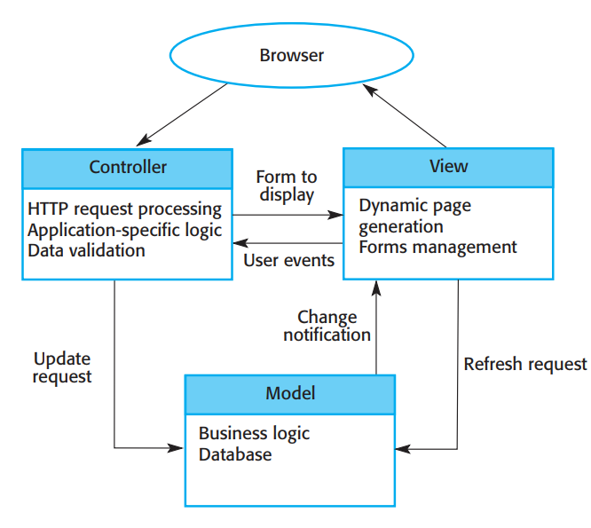
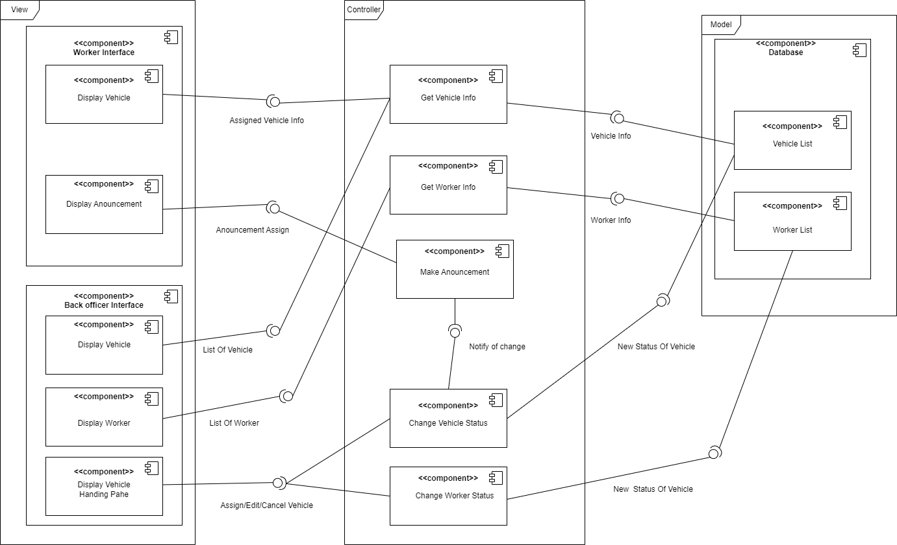
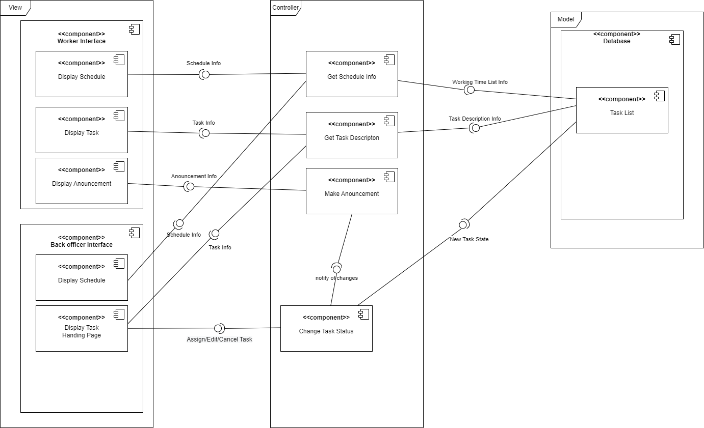
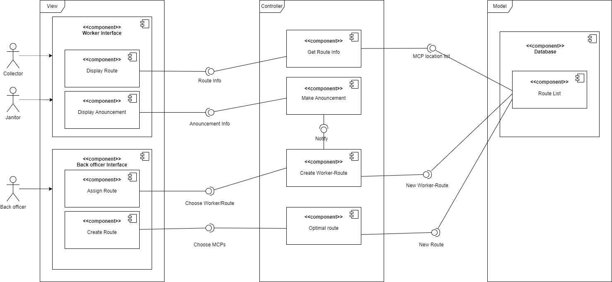

# Architecture Design

## 1. Architectural approach, modules

### 1.1 Architectural approach

	

Mô hình MVC có ba thành phần chính:
- *Model:* Là thành phần lưu trữ và cung cấp các giao thức tương tác trực tiếp với cơ sở dữ liệu, cung cấp dữ liệu cho View để trình bày cho người dùng.
- *View:* Là thành phần quản lý giao diện người dùng, bao gồm việc trình bày trang web động, phụ thuộc vào dữ liệu lấy được từ database và trình bày các biểu mẫu để người dùng có thể nhập thông tin.
- *Controller:* Là thành phần tiếp nhận và xử lý các yêu cầu dựa vào dữ liệu nhận được từ View; xử lý các logic cụ thể của ứng dụng; xác thực thông tin.

Browser đóng vai trò là cầu nối giữa các thao tác người dùng và việc xử lý các login liên quan.

*Lợi ích của mô hình MVC:* Tách riêng biệt những thành phần của sản phẩm, giúp việc thiết kế, quản lý và bảo trì dễ dàng, nhanh chóng và ít lỗi hơn; cho phép dữ liệu và giao diện người dùng tồn tại độc lập, thay đổi riêng biệt với nhau.

### 1.2 Modules

UWC 2.0 sẽ có 4 module: User management (quản lý người dùng), database management (quản lý cơ sở dữ liệu), view management (quản lý giao diện) và application logic processing (xử lý logic ứng dụng).

*a. User management:* Quản lý các hoạt động liên quan đến danh tính người dùng, bao gồm xác thực (authentication) và phân quyền (authorization).

- Authentication kiểm tra thông tin tài khoản (credentials) của người dùng nhập có đúng như đã lưu trong database hay không, nhằm xác định có cho phép người dùng đó vào hệ thống hay không.
- Authorization kiểm tra người dùng có được cấp quyền để xem hoặc thực hiện một tác vụ nào đó hay không.

|  | Xác thực| Phân quyền |
| ----------- | ----------- | ----------- |
| Input | Username hoặc email và password. | Tác vụ hoặc nội dung người dùng muốn dùng / xem, role của người dùng. |
| Output | Cho phép người dùng vào hệ thống nếu thông tin đúng, từ chối nếu ngược lại. | Cho phép người dùng sử dụng / xem tác vụ hoặc nội dung nếu người dùng được cấp quyền, từ chối nếu ngược lại. |

*b. Database management:* Quản lý các hoạt động liên quan đến cơ sở dữ liệu, bao gồm tạo cơ sở dữ liệu và xử lý yêu cầu (xem thông tin và cập nhật dữ liệu cho MCP và nhân viên).

|  | Tạo CSDL| Xử lý yêu cầu |
| ----------- | ----------- | ----------- |
| Input |Yêu cầu nghiệp vụ của ứng dụng. | Yêu cầu (xem, thêm, xóa hay sửa), đối tượng (nhân viên hay MCP) và dữ liệu tương ứng. |
| Output | CSDL thỏa mãn yêu cầu được tạo, bao gồm các schema, model, relation, ... để lưu được thông tin, lịch làm việc của nhân viên và thông tin MCP và phương tiện. | CSDL được cập nhật hoặc trả về dữ liệu thích hợp cho controller tùy vào yêu cầu và dữ liệu tương ứng. |

*c. View management:* Quản lý giao diện (động và tĩnh) được trình bày ra đối với người dùng, bao gồm quản lý các thành phần UI liên quan (thành phần hiển thị thông tin nhân viên và phương tiện, lịch làm việc, ...) và xử lý logic cùng với user event.

|  | Quản lý thành phần UI | Xử lý logic và user event |
| ----------- | ----------- | ----------- |
| Input | hiết kế các thành phần UI (mockup, wireframe, ...). | Các điều kiện logic (if else) và user event (click, rê chuột, ấn phím, ...). |
| Output | Thành phần UI tương ứng được hiển thị trên màn hình cho người dùng (trang web thông tin, trang web lịch làm việc, ...). | Hiển thị các yếu tố nhất định trên UI tùy thuộc vào điều kiện logic; thực hiện các tác vụ tùy thuộc vào user event. |

*d. Application logic processing:* Xử lý toàn bộ các logic của ứng dụng, bao gồm giao việc (back officer cho collector và janitor), chọn người và phương tiện thích hợp, tạo đường đi và gửi thông báo / giao tiếp giữa các nhân viên.

|  | Chọn người, phương tiện | Tạo đường đi  | Thông báo / giao tiếp | Giao việc |
| ----------- | ----------- | ----------- | ----------- | ----------- |
| Input |  Tình trạng các collector, janitor và phương tiện. | Tuyến đường thực tế (map) và thông tin các MCP. | Người gửi, người nhận và thông báo / tin nhắn cần chuyển | Thông tin hoàn chỉnh về đường đi, phương tiện và người được chọn. |
| Output | Người và phương tiện thích hợp được chọn. | Đường đi tối ưu được tạo. | Thông báo / tin nhắn được gửi như mong muốn. | Người được chọn nhận được thông tin về tuyến đường và phương tiện. |

## 2. Implementation diagram

### 2.1 Assign vehicle

	

**Mô tả:**
- Trong giao diện của Collector và Janitor đều có khối hiển thị phương tiện được giao (Display Vehicle) và hiển thị thông báo (Display Announcements).
- Trong giao diện của Back Officer có khối giao phương tiện (Assign vehicle) và khối hiện thị công nhân(Display Workers) và khối hiển thị phương tiện (Display Vehicles).

### 2.2 Assign task

	

**Mô tả:**
- Trong giao diện của Collector và Janitor đều có khối hiển thị thời khóa biểu (Display Schedule), khối hiển thị nhiệm vụ (Display Tasks) và khối hiển thị thông báo (Display Announcements).
- Khi Collector và Janitor xem thời khóa biểu thì khối Schedule Info sẽ lấy thời gian làm việc từ Database Task List và hiển thị trên khối Display Schedule, tương tự với khối Display Tasks.
- Trong giao diện của Back Officer có khối Display Schedule tương tự với Janitor và Collector,khối xem và chỉnh sửa nhiệm vụ (Display Tasks Landing Page)
- Khi Back Officer thêm/thay đổi/hủy một nhiệm vụ thì thông qua khối Change Task Status sẽ gửi trạng thái thay đổi đến Database Task List và tạo ra thông báo gửi đến Janitor và Collector.

### 2.3 Create route

	

**Mô tả:**
- Trong giao diện của Collector và Janitor đều có khối hiển thị đường đi (Display Route) và hiển thị thông báo (Display Announcements).
- Trong giao diện của Back Officer có khối tạo đường đi (Create Route) và gán đường đi (Assign Route).
